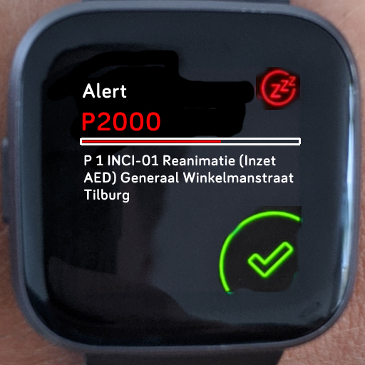
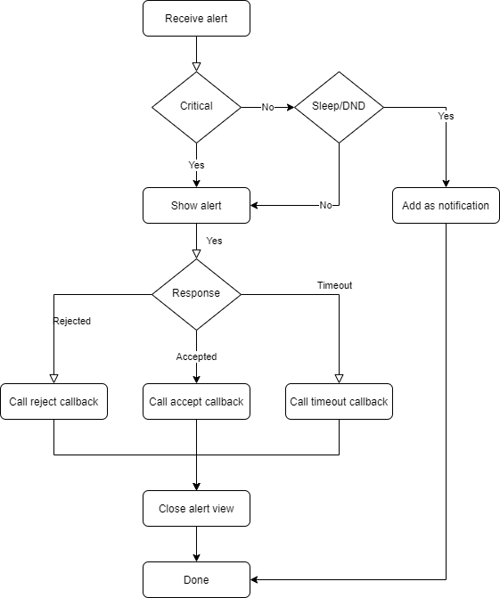

# Fitbit Alerts with response callbacks

**Alert app useful for first responders in any business type**. Useful for many situations where there is currently a dependancy on a pager or mobile app.

The Fitbit Versa 2 already has similar behavior build in like the "accept/decline call (multi responses)" is *very* similar exception it cannot be triggered from an external source.

## Design

A mockup of a potential UI layout for this alert feature.



As you can see the view is basically a blend between the incoming call, the alarm (snooze), and the timer (check icon) views.

- "Alert", the application label
- "P2000", the label of the alert SOURCE
- "timer line", shows how much time is left
- "message" the alert message

It is not required but a line expanding to the right indicating how much time is left until the alarm reaches its timeout. This is similar to the running timer showing a blue line.

Response options could be similar to "incoming call", "alarm" on the Versa 2. Each option could be a corner in the screen as shown in the mockup above.



## Tethered / Untethered

At the moment it seems that Fitbit apps cannot remain running. This also isn't a requirement. An external source will trigger an alert. This alert would usually invoke some API. For example, here it could be a fitbit rest API. As far as I know all fitbit devices are currently tethered to an app on a mobile device. Meaning, the app would receive a notification for the alert and push the alert data to the fitbit device via wifi or bluetooth. Similarly as how it current deals with other app notifications and incoming calls.

I can imagine that the "smart" bit are offloaded. The watch only receives the label, color, duration and message but not any of the callback hools. It then shows the view and based on the result (ack, nack, timeout), the app will do the remaining work which would be the actual invoking of the urls

## Acknowledge versus Accept/Reject

The alarm can have the following behaviors:

- Acknowledge / Timeout
- Accept / Reject / Timeout

### Acknowledge

This screen would behave similarly like the "timer" screen.

Shown when no "reject" callback is specified or when the alert is expired and can no longer be accepted or rejected and only acknowledged.

### Accept/Reject

This screen would behave similarly like the "incoming call" and "scheduled alarm" screen.

Shown when "reject" a callback hook is specified and the alert not yet expired.

## Response options

There are response types:

- Accepted
- Rejected
- Timeout

Each response type can have its own OPTIONAL callback url.

- Simplicity, no string token replacements needed
- Flexibility, multiple services can be used
- Latency, reduces response latency by directly connecting to a service

For example, a confirmation might be send to a different service than the rejection or timeout or via a different channel.

### Timeout

It doesn't make sense to keep buzzing for most alerts.

For example, a dispatch request at a volunteery fire department has a short response window. For example, you must respond within 20 seconds or the system assumes you are unavailable. Meaning, a timeout of 20 seconds would ensure that the alarm/alert stops after 20 seconds.

If the user either didn't accept or reject the app would invoke a "timeout".

## Cancellation

Especially useful in a multi device setup. For example, also having a regular pager and mobile app. If *any* of those integration channels have accepted/rejected the alarm then there is no need to continue to alarm any other channels. These alarms could be cancelled for them to silence.

Not so very important as it is unlikely that you would need to cancel the alarm via the watch.

## Priority levels

Different types of priority levels must exist:

- Normal: Shows an alert and buzzes, but not when in sleep or Do not disturb.
- Critical:  Always shows an alert and buzzes, even when in "sleep" or Do not disturb.

## Sources

Alerts/notifications can originate from different sources/integrations. This as you could have multiple sources and you need to be able to differentiate between the sources.

A source can have a label, a color, or maybe even simple icon.

## Expiration

At first I thought that specifiying an expiration timestamp would be helpful. However, as these durations as in seconds there could be issues with "clock drift".

However, expiration might still be a wise idea. Especially when they are set somewhat in to the future.

For example, an alert was send via email but the email channel is down for an hour.

Meaning, the alert reaches the device too late.

critical : Trigger alarm
expired + normal : Show notification

It is still important to send the "timeout" in case of expiration as it is part of the feedback loop if someone didn't respond.

## Emails as callbacks (optional)

Especially useful if the "incoming" channel could also be email instead of only a REST API as then the response can be send via an email channel too.

## API Example

The alarm payload is very mall. Examples below easily fit within 1025 bytes.

Dispatch alarm is shown with Accept/Reject with a timeout of 20 seconds. It is expected that either of the 3 urls is invoked.

```json
{
    "id"          : "myuniqueidlikemaybeauuid",
    "timeout"     : 20,
    "expires"     : 1590333000,
    "message"     : "A very important thing!",
    "priority"    : "critical",
    "accepthook"  : "https://example.com/myuniqueidlikemaybeauuid/accepted",
    "rejecthook"  : "https://example.com/myuniqueidlikemaybeauuid/rejected",
    "timeouthook" : "https://example.com/myuniqueidlikemaybeauuid/timeout"
}
```

### Minimal with single callback

In some cases the alert payload would just be about ONE thing, using the default timeout duration. Not caring is there was a timeout or rejection.

```json
{
    "id"          : "myuniqueidlikemaybeauuid",
    "message"     : "A very important thing!",
    "accepthook"  : "https://example.com/myuniqueidlikemaybeauuid/accepted"
}
```
Note, the above does not show "priority" thus the 'default' would be used.

### Minimal with no callbacks

This should show a similar design as the Timer with only an acknowledge option for the alert but also be shown while in Sleep/Do Not Disturb.

```json
{
    "id"      : "myuniqueidlikemaybeauuid",
    "message" : "Fire alarm",
    "priority": "critical"
}
```

### Email callback

```json
{
    "id"          : "myuniqueidlikemaybeauuid",
    "timeout"     : 20,
    "message"     : "A very important thing!",
    "priority"    : "critical",
    "accepthook"  : "mailto:someone@example.com?subject=Accepted&body=myuniqueidlikemaybeauuid",
    "rejecthook"  : "mailto:someone@example.com?subject=Rejected&body=myuniqueidlikemaybeauuid",
    "timeouthook" : "mailto:someone@example.com?subject=Timeout&body=myuniqueidlikemaybeauuid"
}
```

## Audience

This feature is useful for a very wide variety of users and applications. In my case I want it as a first responder but I can imagine many markets:

- First responders like fire department, police, ambulance, etc.
- System operators and network administrators
- Deaf people and home automation like fire/smoke detectors for various integrations. Doorbells, motion sensors, basically any kind of urgent event.


